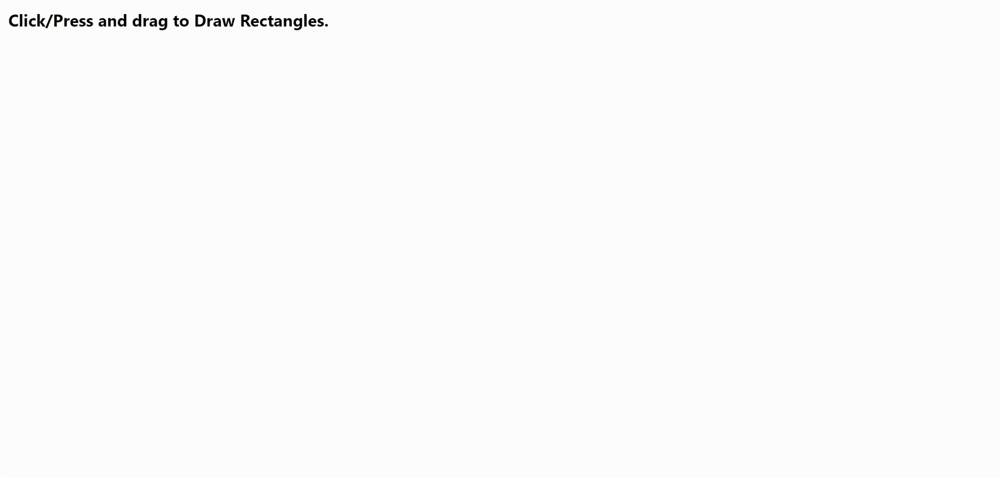

# Intersection over Union
A simple web application that lets you draw two rectangles on the screen. It will printout the IoU(Intersection over Union) on screen.

Try out the demo site [here](https://iou-calculator-prod-iou-calculator-xmzafa.mo1.mogenius.io/)

## Running the Application
You require ``Yarn`` (and ``Docker``) to be set up on your system before running the following commands

## Configuration
* You can modify the following properties for the API:
	* ``PORT`` in .env file (specifies the port at which the API server would run)
	* ``NO_DECIMALS`` in .env file(specifies the number of decimals to be returned from the calculated IoU)
	* ``instances`` in ecosystem.config.js to specify the instances to deploy while in production mode.
* You can modify the following properties for the Client:
	* ``PORT`` in .env file (specifies the port at which the API server would run)
	* ``REACT_APP_WS_URL`` in .env file (specifies the URL to connect to the server.)

### Complete app in production mode
* Change ``REACT_APP_WS_URL`` to ``ws://127.0.0.1:3000`` to point to the local server.
* Run ``yarn app``.
	* Installs the packages.
	* Runs lint
	* Runs all the test cases
	* Creates the Build files
	* Runs the app. API at port: 3000. Client at port:8000 

### Complete app in production mode using docker
* Change ``REACT_APP_WS_URL`` to ``ws://127.0.0.1:3000`` to point to the local server.
* Run ``yarn app:docker``.
	* Runs the app. API at port: 3000. Client at port:8000 

### Frontend in dev mode
* Run ``yarn`` to install the packages.
* Change ``REACT_APP_WS_URL`` to ``ws://127.0.0.1:3000`` to point to the local server.
* Run ``yarn start`` to start the application in a dev environment.
* The application would run on http://localhost:8000/ by default.

### Server in dev mode
* Move to the /api folder
* Run ``yarn`` to install the packages.
* Run ``yarn dev`` to start the application in a dev environment.
* The application would run on http://localhost:8000/ by default.

## Testing the Application
* Run ``yarn`` to install the packages.
* Run ``yarn run test`` to run the tests for the client.
* Run ``yarn run test`` on the /api folder to run the tests for the server.

## Using the application
* Click and drag once to draw the ground truth bounding box.
* Click and drag again to draw the predicted bounding box.
* The IoU % updates on the top left part of the screen when you drag the predicted bounding box.
* Once you draw the predicted bounding box, drawing again, restarts the whole process.

## ScreenShots

## Credits
* [Create React App](https://github.com/facebook/create-react-app)
* [Draw on Canvas](https://codepen.io/bartezic/pen/gOKmwW)
* [MoGenius (used to deploy demo site)](https://studio.mogenius.com/)
